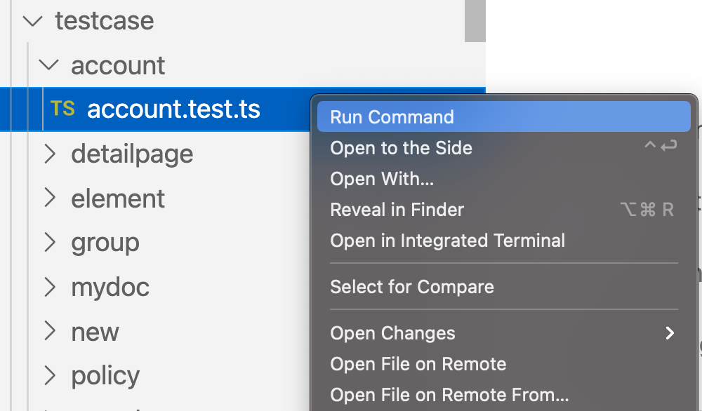
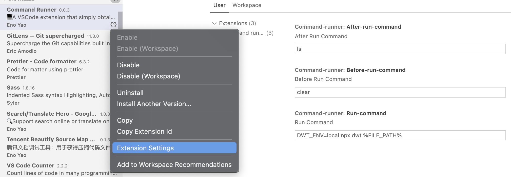

# Command Runner

A VSCode extension that simply obtains the file path and executes the corresponding command.

# How To Use

Click the file directory, select the file, right click the mouse to open the menu bar and select the `Run Command` option to run the preset command.

# Default Configuration

We have preset some commands for you, when you select a file to execute the `Run Command`, the file path will be replaced by `%FILE_PATH%`, and you can change the default settings inside.

| Configuration                     | Command                           |
| --------------------------------- | --------------------------------- |
| command-runner.before-run-command | clear                             |
| command-runner.run-command        | DWT_ENV=local npx dwt %FILE_PATH% |
| command-runner.after-run-command  | ls                                |

# Thanks

<b>❀Tencent Alloy Team</b>

<!-- <b>

Tencent Alloy Team
</b>

| [ Eno Yao](https://github.com/Wscats) |
| ------------------------------------------------------------------------------------------------------------------------------------------- |

 -->

If the extension can help you, please enter the [Rating & Review](https://marketplace.visualstudio.com/items?itemName=Wscats.command-runner&ssr=false#review-details) link to give me a five-star praise.

If you have any questions or suggestions during use, please leave a message in the [issue](https://github.com/Wscats/command-runner/issues/new).
